# LLM Preference Arena - Kaggle

[](#)
[](#)
[](#)
[](#)
[](#)
[](#)

## 🚀 About This Project

This project is my experimentation & solution for the Kaggle Competition: [LLM Classification Finetuning](https://www.kaggle.com/competitions/llm-classification-finetuning/overview)

The competition challenges participants to predict which responses users will prefer in head-to-head battles between chatbots powered by large language models (LLMs). The dataset consists of real-world conversations from the Chatbot Arena, where users interact with two anonymous LLMs and select their preferred answer.

The goal is to develop a machine learning model that can accurately predict user preferences between competing chatbot responses. This task is closely related to building "reward models" or "preference models" in the context of reinforcement learning from human feedback (RLHF). The competition highlights the importance of overcoming common biases such as position bias, verbosity bias, and self-enhancement bias, which can affect preference predictions.

## 🔎 Exploration

As we can see the dataset is already balanced as no evidence of biased selection is made from users due to boredom of selecting the first answer as presented in some papers.

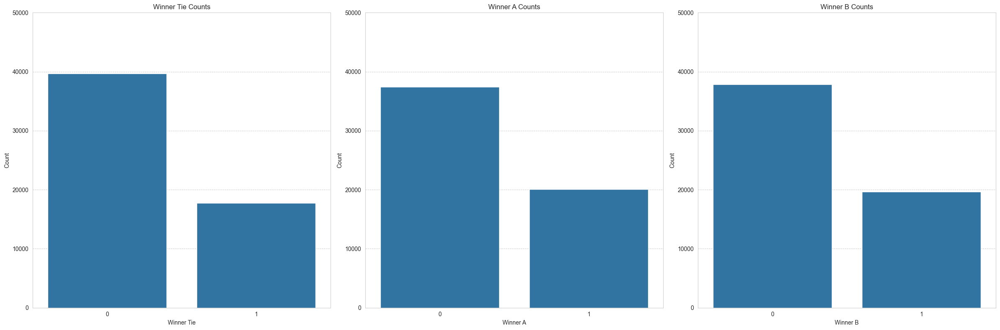

And the dataset mainly utilized OpenAI GPT variants for generation as well as Claude 2.1!
Further more regarding the win rate again models from OpenAI GPT topped the leaderboard probably due to techinques used like RLHF or DPO.
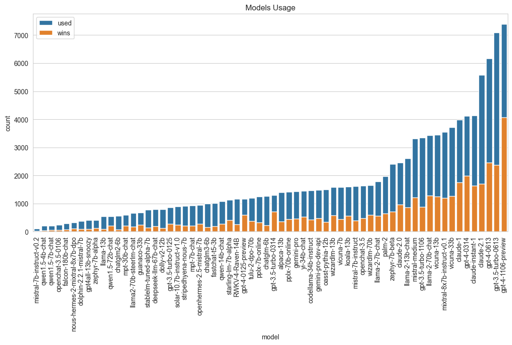
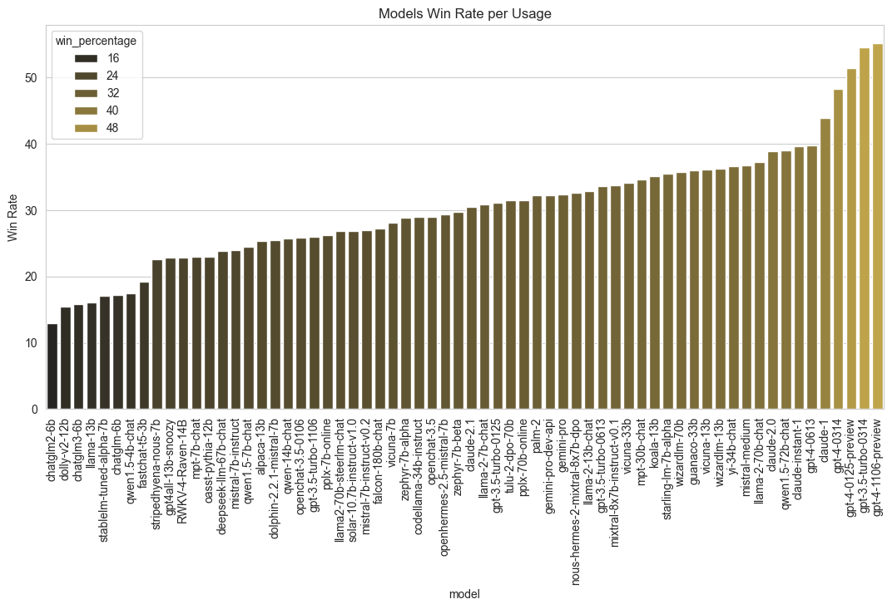

In perspective of text there is no obvious significant leaning towards more on lengthier or smaller outputs.
Nor more or less punctuation play an important role, neither new lines.

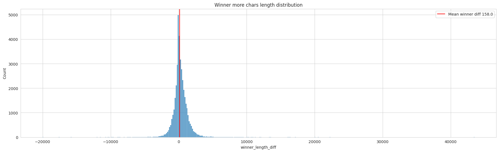
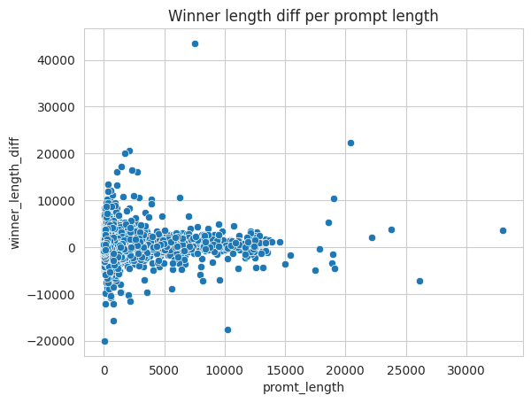
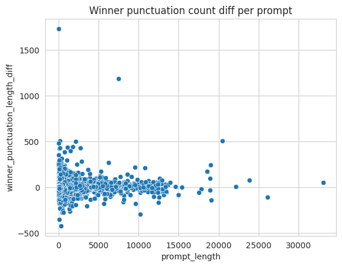

## Training

Initial training experiments on a subset of 1,000 examples demonstrate consistent learning progress om Modern Bert:

```
Epoch 1/10, Training Accuracy: 36.00%
Epoch 2/10, Training Accuracy: 41.11%
Epoch 3/10, Training Accuracy: 46.44%
```

- The validation shows a meaningfull improvement (achieved **~47.60%** accuracy) trained on the 3090 GPU but you need to train for a lot of hours.

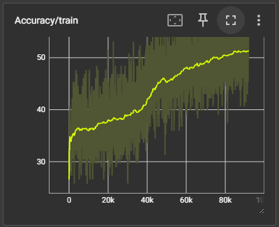
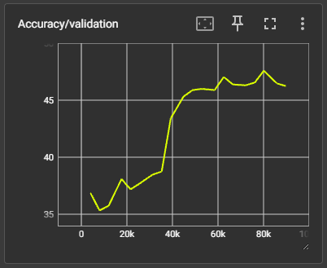

While tokenizing with modern bert tokenizer we use truncation and the max length is **8192** which leads to some examples being cut off but are very few
**less thaN 0.15%**
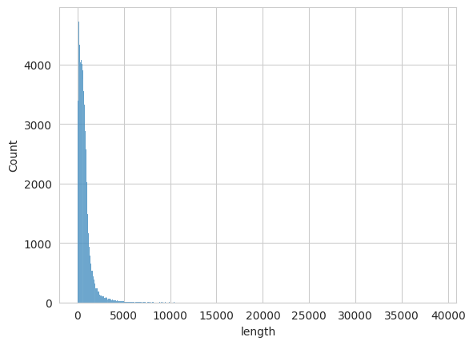

The Modern Bert Trained from scratch including bfloat 16 is huge and i could only pack 4 examples per batch size thus i have gradient accumulation steps in the
code. The reporting happens every n steps where n = gradient accumulation steps. The GPU caps at around 20 GB and during inference at ~22 so thats the current threshold.
Other possible options is to use PEFT, reduce max_length more or split the model to gpus if you have multi gpu cluster.
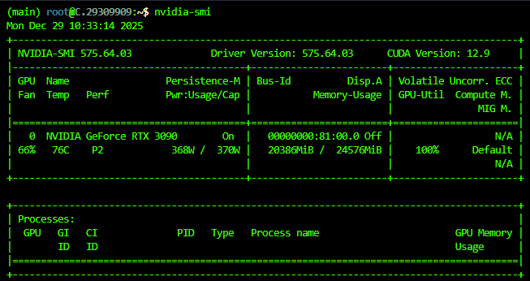

A better solution out of the box is the **llm_trainig.py** where i trained **Qwen3-4B-Instruct-2507 loaded in 8 bit and changed the output head to be a classification linear projector**.
This solution requires a lot of compute power and memory so i used the **NVIDIA RTX PRO 6000 with 98GB VRAM** and achieved only 1 example per batch with 64 accumulation steps.
This finetuning solution achieved at its peak **57.10% accuracy +9.5% from the ModernBert Base.**.
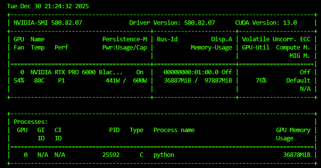
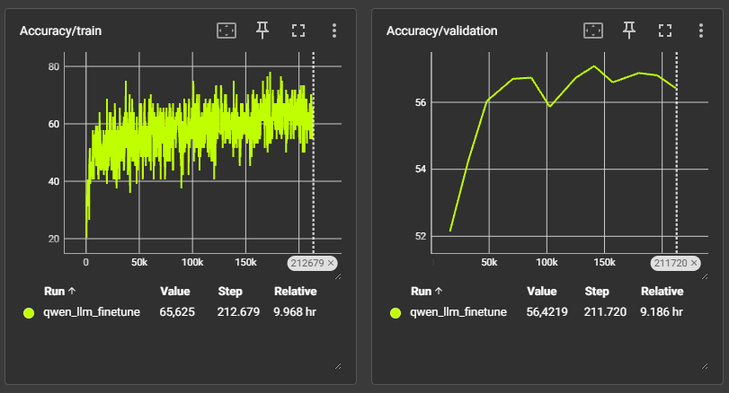

## 🤗 Published Model

This marks my first model publication on Hugging Face! The fine-tuned [Qwen3-4b-merged-preference-classifier](https://huggingface.co/Vmpletsos/qwen3-4b-merged-preference-classifier) preference classifier is now publicly available for the community to use and build upon. The model represents the culmination of extensive experimentation with LLM fine-tuning for preference prediction, achieving 57.10% accuracy on the validation set. Publishing to Hugging Face not only makes the model accessible for inference and further research but also contributes to the open-source ML community's efforts in understanding and improving AI alignment through preference modeling. The repository includes both the model weights and tokenizer, making it straightforward for others to integrate this preference classifier into their own projects or use it as a baseline for further improvements.

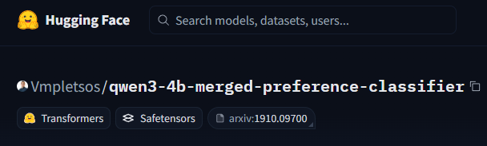
